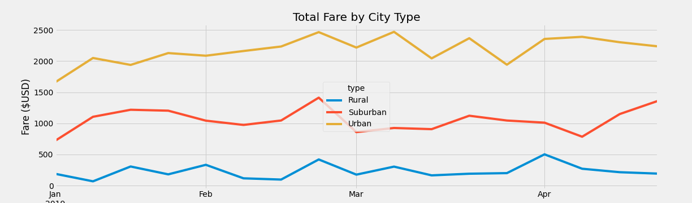
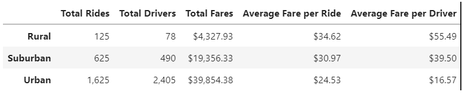

# PyBer Analysis
## Overview
PyBer is a ridesharing app for which we have been asked to perform exploratory analysis on the data to showcase the relationships between the city types by drivers and riders as well as the percentage of fares by drivers and riders in each city type.  With our analysis and visualizations, management will determine affordability for underserved neighborhoods and improve access to rideshare services.
## Resources
Data:  .csv files:  city_data, ride_data 
Software(s):  Python 3.7, Jupyter Lab 3.0.14, Pandas, NumPy, SciPy, Matplotlib
## Results
As demonstrated in the line chart below, approximately 65% of total fares are earned in urban cities, with 30% in suburban and only 5% in rural cities.  

Accordingly, the total number of rides and drivers mirror the fare percentages in each city type. We have included the following summary table to support our findings.

## Summary
Based on our analysis, there is correlation of fares to number of trips and drivers.  We would recommend:
  1) increasing the number of drivers in rural cities.  Per the summary table, the average fares per ride and driver in the rural cities are much higher which can indicate that rides are longer in distance, which could also result in less availability of drivers to meet demand.
  2) reducing the number of drivers in urban cities.  There is a direct relationship of drivers to overhead: reducing the number of drivers will reduce the amount of overhead.  The analysis indicates there could be a greater supply than demand based on the average fare per driver.
  3) adjusting fare rates in rural and urban cities.  Discounting fare rates based on distance could encourage more fares in the rural cities while increasing fare rates in urban cities during peak hours, such as 7 - 9 a.m. and 4 - 6 p.m. could increase average fares per ride and driver.
